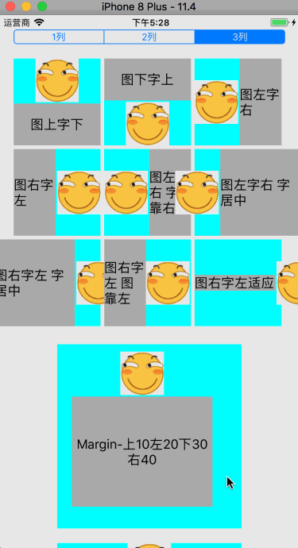

# Y_ImgTitlButton
对 UIButton 进行封装，快速创建一个带有图片和标题的按钮。

## 功能
以前定义一个带有图片和标题的按钮，要想按照自己的方式排布，免不了要用到 contentVerticalAlignment、contentHorizontalAlignment、imageEdgeInsets、titleEdgeInsets 等之类的。

现在只需要通过自定义的按钮类型，如上图下字、左图右字等，来创建带有图片和标题的按钮，方便使用。

定义的枚举类型如下：
```objc
typedef enum {
    ImageTopTitleBottom,        //图上字下
    TitleTopImageBottom,        //图下字上
    ImageLeftTitleRight,        //图左字右
    TitleLeftImageRight,        //图右字左
    
    ImageLeftTitleRightLeft,    //图左字右 字靠右
    ImageLeftTitleRightCenter,  //图左字右 字居中
    
    TitleLeftImageRightCenter,  //图右字左 字居中
    TitleLeftImageRightLeft,    //图右字左 图靠左
    
    FitTitleLeftImageRight,     //图右字左适应
}ButtonStyle;
```

## 使用

* 普通使用
```objc
//创建一个图上字下的按钮
Y_ImgTitlButton *button = [[Y_ImgTitlButton alloc] initWithStyle:ImageTopTitleBottom];

```

* 带有 margin 的按钮
```objc
//设置按钮的 margin
Y_ImgTitlButton *button = [[Y_ImgTitlButton alloc] initWithStyle:ImageTopTitleBottom margin:UIEdgeInsetsMake(10, 20, 30, 40)];

```

* 带有 margin 和 padding 的按钮
```objc
//设置按钮的 margin
Y_ImgTitlButton *button = [[Y_ImgTitlButton alloc] initWithStyle:ImageLeftTitleRight margin:UIEdgeInsetsMake(0, 0, 0, 0) padding:CGSizeMake(20, 2333)];

```

## Example


详细使用参见 Example
